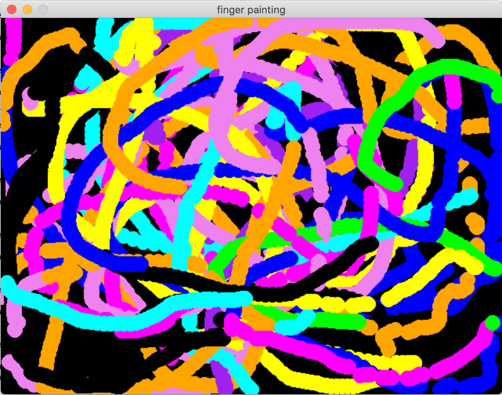

Finger painting with multi-touch
================================

.. container:: separator

   |screenshot_finger_painting|

|

Touch screens like on phones, and some track pads on laptops allow tracking more than one point of contact. New in pygame 2 is support for Multi-Touch.

In this piece:

- We will describe some new finger tracking events,
- show a demo of how to use them in a "finger painting" program.

Finger events
-------------

pygame 2 brings these new event types.

FINGERDOWN
	A finger has touched the surface.

FINGERMOTION
	A finger is moving on the surface.

FINGERUP
	A finger is not touching the surface anymore.

Finger event attributes
~~~~~~~~~~~~~~~~~~~~~~~

Each of the types of events has the same attributes.

touch_id (int)
	the touch device id. So you can see which device this is from.
	This is useful if you have say a multi touch screen, and a touch pad.

finger_id (int)
	the finger id
	Lots of people have 10 fingers. Multi touch devices can often detect
	a number of different fingers moving around at once.

x (float)
	the x-axis location of the touch event, normalized (0...1)

y (float)
	the y-axis location of the touch event, normalized (0...1)

dx (float)
	the distance moved in the x-axis, normalized (-1...1)

dy (float)
	the distance moved in the y-axis, normalized (-1...1)

pressure (float)
	the quantity of pressure applied, normalized (0...1)

Code: finger_painting_multi_touch.py
------------------------------------

Here we have a nice little demo of using the FINGER events.

.. code-block:: python

	#!/usr/bin/env python
	import os
	import pygame as pg

	# This makes the touchpad be usable as a multi touch device.
	os.environ['SDL_MOUSE_TOUCH_EVENTS'] = '1'

	def main():
	    pg.init()

	    # Different colors for different fingers.
	    colors = [
	        'red', 'green', 'blue', 'cyan', 'magenta',
	        'yellow', 'black', 'orange', 'purple', 'violet'
	    ]
	    available_colors = colors[:] + colors[:] # two copies for people with 12 fingers.

	    # keyed by finger_id, and having dict as a value like this:
	    # {
	    #     'x': 20,
	    #     'y': 20,
	    #     'color': 'red',
	    # }
	    circles = {}

	    width, height = (640, 480)
	    screen = pg.display.set_mode((width, height))
	    clock = pg.time.Clock()
	    pg.display.set_caption('finger painting with multi-touch')
	    # we hide the mouse cursor and keep it inside the window.
	    pg.event.set_grab(True)
	    pg.mouse.set_visible(False)

	    going = True
	    while going:
	        for e in pg.event.get():

	            # We look for finger down, finger motion, and then finger up.
	            if e.type == pg.FINGERDOWN:
	                circles[e.finger_id] = {
	                    'color': available_colors.pop(),
	                    'x': int(width * e.x),  # x and y are 0.0 to 1.0 in touch space.
	                    'y': int(height * e.y), #     we translate to the screen pixels.
	                }
	            elif e.type == pg.FINGERMOTION:
	                circles[e.finger_id].update({
	                    'x': int(width * e.x),
	                    'y': int(height * e.y),
	                })
	            elif e.type == pg.FINGERUP:
	                available_colors.append(circles[e.finger_id]['color'])
	                del circles[e.finger_id]
	            elif ((e.type == pg.KEYDOWN and e.key in (pg.K_q, pg.K_ESCAPE))
	                or e.type == pg.QUIT):
	                going = False

	        # lets draw a circle for each finger.
	        for finger_id, circle in circles.items():
	            pg.draw.circle(screen, circle['color'], (circle['x'], circle['y']), 10)

	        clock.tick(60)
	        pg.display.flip()

	if __name__ == "__main__":
	    main()

