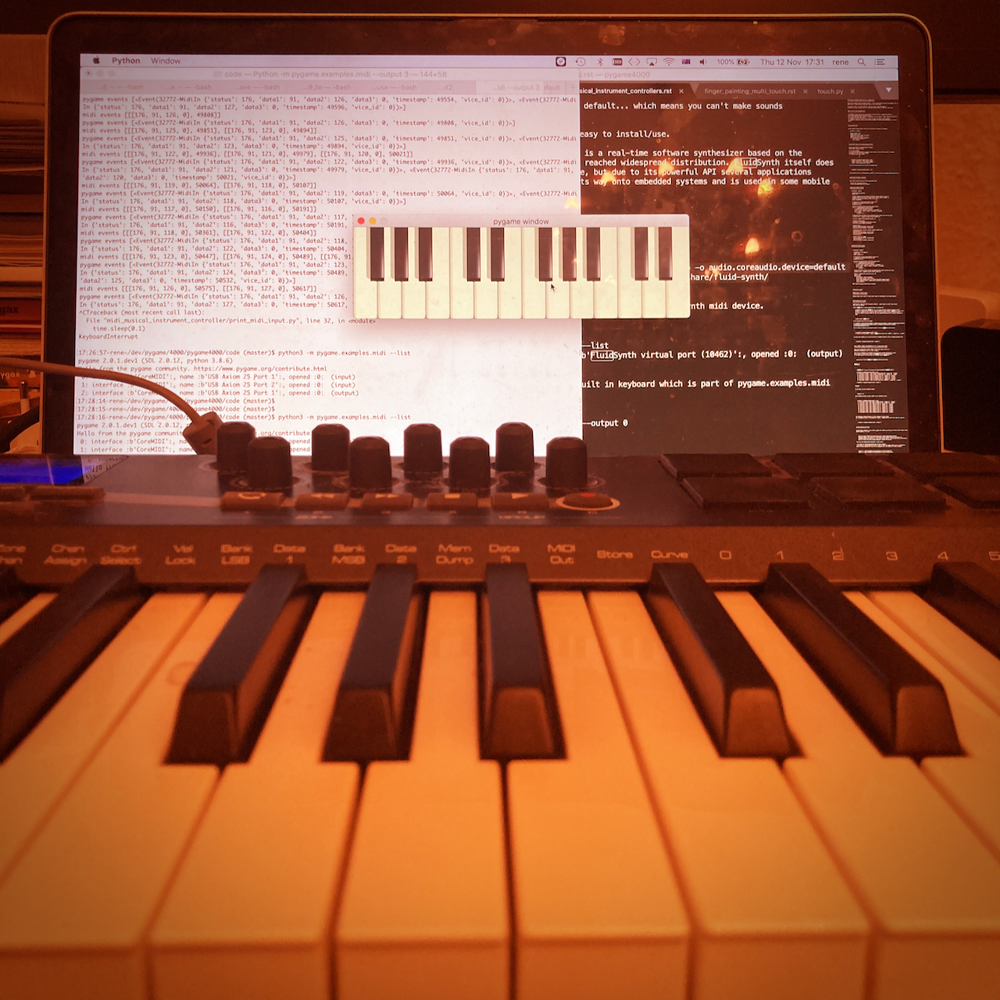

Midi musical intrument controllers and synthesizers
===================================================

.. container:: separator

   |screenshot_finger_painting|

|

Musical Instrument Digital Interface (Midi), is for letting digital musical instruments talk to each other. It came from the early 80s, and is still used today.

The main idea is that rather than sending audio data, it sends small control messages.
This is great for fast real time low bandwidth communication.

I'm going to show in all the different ways midi can be used with pygame,
and how to set up a virtual synth (I've included instructions for Win, Mac, and Linux).

What can you do with pygame.midi?
---------------------------------

1) **Play**: If you want to play a midi file, then you can use `pygame.mixer.music <https://www.pygame.org/docs/ref/music.html>`_.
2) **List**: See what midi devices are available on your computer. Maybe connected via USB or via a sound card with midi cables.
3) **Input**: Use music controllers as input for your app (like a midi keyboard).
4) **Output**: Send midi events to musical instruments (like analog synthesizers, or virtual synths)

Playing midi files
------------------

pygame supports playing midi files so you can hear the music via a speaker.

.. code-block:: python

    import pygame, time
    pygame.mixer.init()
    pygame.mixer.music.load('file.midi')
    pygame.mixer.music.play()
    while pygame.mixer.music.get_busy():
        print('Still playing :)')
        time.sleep(1)

Listing midi devices with pygame.examples.midi
----------------------------------------------

pygame comes with an interesting midi example.
It has three features really.

1) List midi devices
2) Use an onscreen keyboard to output to midi devices (like virtual synths, or musical instruments at the end of midi cables)
3) Print the midi input events

::

    $ python3 -m pygame.examples.midi --help
    --input [device_id] : Midi message logger
    --output [device_id] : Midi piano keyboard
    --list : list available midi devices

To list the midi devices you can use the example app.

::

    $ python3 -m pygame.examples.midi --list

See the section later on "Setting up a synth" to see how to use the pygame.examples.midi more.

pygame.midi API basic explainer
-------------------------------

Now we will show the basics of this pygame.midi API.

- How to list the output devices.
- How to send midi output to a device.

pygame.midi.Output example
~~~~~~~~~~~~~~~~~~~~~~~~~~

.. code-block:: python

    # code/midi_musical_instrument_controller/midi_play_note.py
    import time

    # import pygame.midi and initialize the midi module before you use it.
    # pygame.midi is not a default pygame module so you need to import it,
    # and also pygame.init does not init it for you.
    import pygame.midi

    # initialize the midi module before you use it.
    #  pygame.init does not do this for you.
    pygame.midi.init()

    # print the devices and use the last output port.
    for i in range(pygame.midi.get_count()):
        r = pygame.midi.get_device_info(i)
        (interf, name, is_input, is_output, is_opened) = r
        print (interf, name, is_input, is_output, is_opened)
        if is_output:
            last_port = i

    # You could also use this to use the default port rather than the last one.
    # default_port = pygame.midi.get_default_output_id()

    midi_out = pygame.midi.Output(last_port, 0)

    # select an instrument.
    instrument = 19 # general midi church organ.
    midi_out.set_instrument(instrument)

    # play a note.
    midi_out.note_on(note=62, velocity=127)
    midi_out.note_off(note=62, velocity=0)

    # sleep for a bit, and play another higher pitched note.
    time.sleep(0.2)
    midi_out.note_on(note=80, velocity=127)
    midi_out.note_off(note=80, velocity=0)
    time.sleep(0.2)

    # play a note for longer.
    midi_out.note_on(note=62, velocity=127)
    time.sleep(0.8)
    midi_out.note_off(note=62, velocity=0)

pygame.midi.Input example
~~~~~~~~~~~~~~~~~~~~~~~~~

Here we see how to read midi events from a device like an attached USB keyboard.

.. code-block:: python

    # code/midi_musical_instrument_controller/print_midi_input.py
    import time
    import pygame.midi

    # initialize the midi module before you use it.
    pygame.midi.init()

    # print the devices
    for i in range(pygame.midi.get_count()):
        r = pygame.midi.get_device_info(i)
        (interf, name, is_input, is_output, is_opened) = r
        print (interf, name, is_input, is_output, is_opened)

    device_id = pygame.midi.get_default_input_id()

    print('Using device id: %s' % device_id)
    midi_in = pygame.midi.Input(device_id)
    going = True
    print ('Use ctrl+c to quit')
    while going:
        midi_events = midi_in.read(20)
        if midi_events:
            print('midi events', midi_events)
            # make some pygame.Events to be used like other pygame events.
            print('pygame events', pygame.midi.midis2events(midi_events, device_id))
        time.sleep(0.1)

Setting up a synth
------------------

Windows built in midi synth
~~~~~~~~~~~~~~~~~~~~~~~~~~~

Windows comes with a built in midi synth, which is detectable as an output device.

MacOS Setting up a synth
~~~~~~~~~~~~~~~~~~~~~~~~

MacOS doesn't come with one running by default... which means you can't make sounds
with your midi Output.

Luckily fluidsynth is pretty good and easy to install/use.

    A SoundFont Synthesizer FluidSynth is a real-time software synthesizer based on the SoundFont 2 specifications and has reached widespread distribution. FluidSynth itself does not have a graphical user interface, but due to its powerful API several applications utilize it and it has even found its way onto embedded systems and is used in some mobile apps.

::

    $ brew install fluid-synth

In one terminal tab start the synth:

$ fluidsynth -o midi.driver=coremidi -o audio.driver=coreaudio -o audio.coreaudio.device=default -o audio.period-size=256 /usr/local/Cellar/fluid-synth/2.1.2/share/fluid-synth/sf2/VintageDreamsWaves-v2.sf2

Then in another terminal you should be able to see the FluidSynth midi device.

::

    $ python3 -m pygame.examples.midi --list
    0: interface :b'CoreMIDI':, name :b'FluidSynth virtual port (10462)':, opened :0:  (output)

Now play some sounds on it using the built in keyboard which is part of pygame.examples.midi

::

    $ python3 -m pygame.examples.midi --output 0

Linux: Debian, Ubuntu and Raspberry Pi OS - setup a midi synth
~~~~~~~~~~~~~~~~~~~~~~~~~~~~~~~~~~~~~~~~~~~~~~~~~~~~~~~~~~~~~~

Maybe you already have a midi synth in your linux setup, but it is
becoming increasingly rare. So, just in case...

There are an explosion of different audio and midi systems available on linux.
We are going to setup both timidity and fluidsynth virtual synthesizers.
If you were going to use only one, then perhaps choose fluidsynth.

::

    sudo apt-get install fluidsynth fluid-soundfont-gm timidity

Fluidsynth
''''''''''

::

    $ fluidsynth -a alsa -m alsa_seq /usr/share/sounds/sf2/FluidR3_GM.sf2

    $ python3 -m pygame.examples.midi --list
     0: interface :b'ALSA':, name :b'Midi Through Port-0':, opened :0:  (output)
     1: interface :b'ALSA':, name :b'Midi Through Port-0':, opened :0:  (input)
     2: interface :b'ALSA':, name :b'TiMidity port 0':, opened :0:  (output)
     3: interface :b'ALSA':, name :b'TiMidity port 1':, opened :0:  (output)
     4: interface :b'ALSA':, name :b'TiMidity port 2':, opened :0:  (output)
     5: interface :b'ALSA':, name :b'TiMidity port 3':, opened :0:  (output)
     6: interface :b'ALSA':, name :b'Synth input port (5852:0)':, opened :0:  (output)

    $ python3 -m pygame.examples.midi --output 6

Timidity
''''''''

In one shell run the timidity server.

::

    timidity -iA

Now we should be able to see a whole lot of devices listed.

::

    $ python -m pygame.examples.midi --list
     0: interface :ALSA:, name :Midi Through Port-0:, opened :0:  (output)
     1: interface :ALSA:, name :Midi Through Port-0:, opened :0:  (input)
     2: interface :ALSA:, name :TiMidity port 0:, opened :0:  (output)
     3: interface :ALSA:, name :TiMidity port 1:, opened :0:  (output)
     4: interface :ALSA:, name :TiMidity port 2:, opened :0:  (output)
     5: interface :ALSA:, name :TiMidity port 3:, opened :0:  (output)
     6: interface :ALSA:, name :TiMidity port 0:, opened :0:  (output)
     7: interface :ALSA:, name :TiMidity port 1:, opened :0:  (output)
     8: interface :ALSA:, name :TiMidity port 2:, opened :0:  (output)
     9: interface :ALSA:, name :TiMidity port 3:, opened :0:  (output)

The following command brings up a mini keyboard to play notes.
Try a few ports to see if they make any sound... maybe ports 6 and 7 will work for you too.

::

    $ python -m pygame.examples.midi --output 6

Trouble shooting on linux
'''''''''''''''''''''''''

On some linux systems if you install pygame with wheels you may get an error about "Cannot open shared library..." or so.

::

    ALSA lib conf.c:3558:(snd_config_hooks_call) Cannot open shared library libasound_module_conf_pulse.so (/usr/lib/alsa-lib/libasound_module_conf_pulse.so: libasound_module_conf_pulse.so: cannot open shared object file: No such file or directory)
    ALSA lib seq.c:935:(snd_seq_open_noupdate) Unknown SEQ default

There are two workarounds available to this issue.

* You could try installing pygame with apt-get instead.
* You could try symlinking the folder to the one that the pygame wheel alsa is looking for. Which of these symlinks of these to use depends on if your system is i386 or x86_64.

::

    sudo ln -s /usr/lib/i386-linux-gnu/alsa-lib /usr/lib/alsa-lib
    sudo ln -s /usr/lib/x86_64-linux-gnu/alsa-lib /usr/lib/alsa-lib

