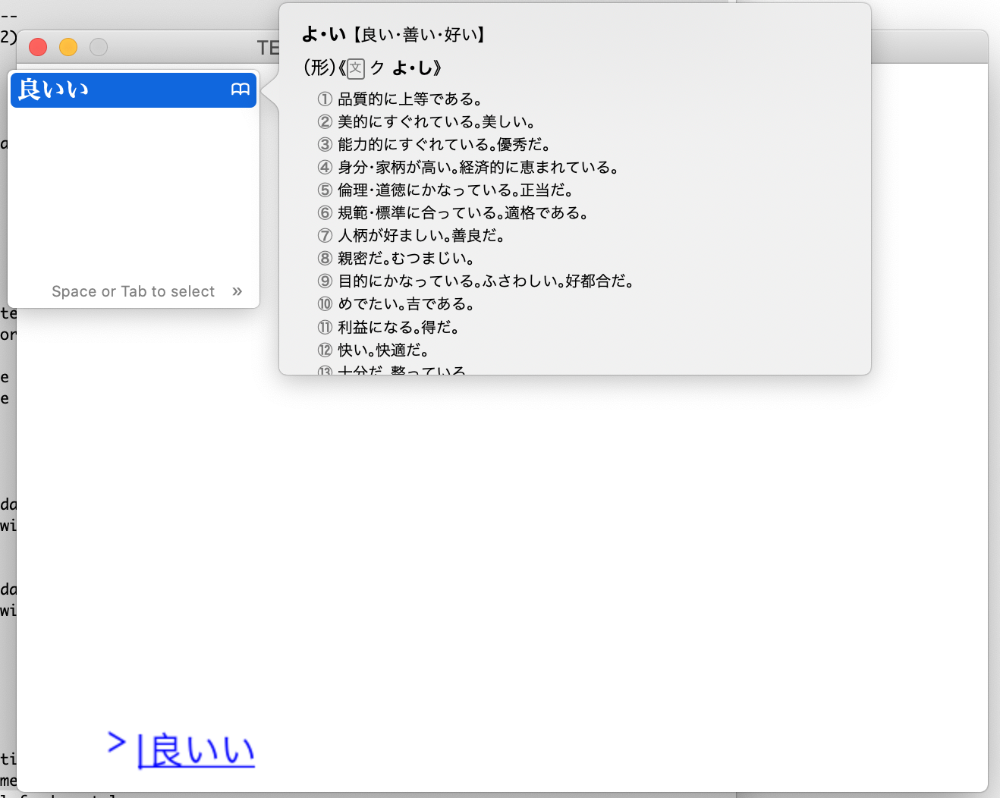

Text Editing Input IME
======================

.. container:: separator

   |screenshot_text_editing_input_ime|

|

Why is TEXTINPUT needed when we have KEYDOWN events? It's because one key press doesn't always match up to one character generated. Sometimes several characters can be generated. This is why the old KEYDOWN events are not sometimes enough.

Input Method Editor (IME) is an operating system function that lets you generate different characters that may even be on your input device. Especially popular with languages such as Korean, Chinese, Japanese, Vietnamese, and Indic characters - but is also used in European languages

New events, their fields, and description
-----------------------------------------

pygame.TEXTINPUT
~~~~~~~~~~~~~~~~

- type: int, pygame.TEXTINPUT
- text: str, the UTF-8 editing text.

pygame.TEXTEDITING
~~~~~~~~~~~~~~~~~~

- type: int, pygame.TEXTEDITING
- text: str, the UTF-8 editing text.
- start: int, the location to begin editing from
- length: int, the number of characters to edit from the start point

If you are familiar with pygame events it's just like this.
::

    # We need to enable text input to get the IME going, and to get TEXTEDITING events.
    pygame.key.start_text_input()

    if e.type == pg.TEXTEDITING:
        print(e.text)	# the text being edited
        print(e.start)  # start of text editing
        print(e.length) # selection length

	if e.type == pg.TEXTINPUT:
        print (e.text) # the text input after editing is done.

Try IME yourself?
-----------------

Maybe you want to try it out, but usually you use basic English?

- Mac: How to set up Japanese on Mac. https://support.apple.com/guide/japanese-input-method/set-up-the-input-source-jpim10267/mac
- Windows: "Installing and Using Input Method Editors" https://docs.microsoft.com/en-us/windows/win32/dxtecharts/installing-and-using-input-method-editors
- Ubuntu: "Japanese Input This article provides information on how to setup Japanese input on an English Ubuntu installation." https://help.ubuntu.com/community/JapaneseInput

Larger example
--------------

.. code-block:: python

	#!/usr/bin/env python
	""" A mini chat app.

	A little "console" where you can write in text.

	Shows how to use the TEXTEDITING and TEXTINPUT events.

	pg.key.start_text_input() - Start receiving TEXTEDITING and TEXTINPUT events.
	pg.key.stop_text_input() - Start receiving TEXTEDITING and TEXTINPUT events.
	pg.key.set_text_input_rect() - rectangle may be used for IME where candidate list may open.
	"""
	from collections import deque
	import pygame as pg
	import pygame.freetype as freetype

	def load_fonts():
	    fontnames = ",".join(
	        (
	            "hiraginosansgb",  # japanese
	            "hiraginosanscns",  # japanese
	            "Arial",
	        )
	    )
	    font = freetype.SysFont(fontnames, 24)
	    font_small = freetype.SysFont(fontnames, 16)
	    return font, font_small

	class EditingText:
	    """A state machine which handles text editing events."""

	    def __init__(self, chat_entries):
	        self.pos = 0
	        self.editing = False
	        self.text = ""
	        self.text_pos = 0
	        self.editing_text = ""
	        self.editing_pos = 0
	        self.chat_entries = chat_entries

	    def state(self):
	        return (
	            self.pos,
	            self.editing,
	            self.text,
	            self.text_pos,
	            self.editing_text,
	            self.editing_pos,
	        )

	    def reset(self):
	        self.text = ""
	        self.text_pos = 0

	    def text_editing(self, start, text):
	        self.editing = True
	        self.editing_text = text
	        self.editing_pos = start

	    def text_input(self, text):
	        self.editing = False
	        self.editing_text = ""
	        self.text = self.text[0 : self.text_pos] + text + self.text[self.text_pos :]
	        self.text_pos += len(text)

	    def backspace(self):
	        if len(self.text) > 0 and self.text_pos > 0:
	            self.text = self.text[0 : self.text_pos - 1] + self.text[self.text_pos :]
	            self.text_pos = max(0, self.text_pos - 1)

	    def delete(self):
	        self.text = self.text[0 : self.text_pos] + self.text[self.text_pos + 1 :]

	    def left(self):
	        self.text_pos = max(0, self.text_pos - 1)

	    def right(self):
	        self.text_pos = min(len(self.text), self.text_pos + 1)

	    def enter(self):
	        if self.text:
	            self.chat_entries.append(self.text)
	            self.reset()

	class HandleEditing(EditingText):
	    """ This keeps the pygame event handling separate from EditingText.
	    """
	    def handle_events(self, events):
	        for event in events:
	            if event.type == pg.TEXTEDITING:
	                self.text_editing(start=event.start, text=event.text)
	            elif event.type == pg.TEXTINPUT:
	                self.text_input(event.text)
	            elif event.type == pg.KEYDOWN:
	                if self.editing:
	                    if len(self.editing_text) == 0:
	                        self.editing = False
	                    continue
	                if event.key == pg.K_BACKSPACE:
	                    self.backspace()
	                elif event.key == pg.K_DELETE:
	                    self.delete()
	                elif event.key == pg.K_LEFT:
	                    self.left()
	                elif event.key == pg.K_RIGHT:
	                    self.right()
	                elif (
	                    event.key in [pg.K_RETURN, pg.K_KP_ENTER]
	                    and len(event.unicode) == 0
	                ):
	                    self.enter()
	        return events

	class StateSprite(pg.sprite.DirtySprite):
	    """ This makes it easier to track state changes,
	        and only redraw if things change.
	    """
	    _last_state = None
	    dirty = 0
	    def check_dirty(self):
	        state = self.state()
	        if state == self._last_state:
	            self.dirty = 0
	            return False
	        self._last_state = state
	        self.dirty = 1
	        return True

	class ChatInputEdit(StateSprite):
	    def __init__(self, editing, font, text_color, background_color):
	        StateSprite.__init__(self)
	        self.editing = editing
	        self.font = font
	        self.text_color = text_color
	        self.background_color = background_color
	        self.rect = pg.Rect(30, 440, pg.display.get_surface().get_width(), 40)
	        self.image = pg.Surface((self.rect.width, self.rect.height)).convert_alpha()

	    def state(self):
	        return self.editing.state()

	    def update(self):
	        if not self.check_dirty():
	            return

	        editing = self.editing
	        font = self.font
	        text_color = self.text_color

	        self.image.fill(self.background_color)

	        start_pos = pg.Rect(30, 0, self.rect.w, self.rect.h)
	        ime_text_l = "> " + editing.text[0 : editing.text_pos]
	        ime_text_m = (
	            editing.editing_text[0 : editing.editing_pos]
	            + "|"
	            + editing.editing_text[editing.editing_pos :]
	        )
	        ime_text_r = editing.text[editing.text_pos :]

	        rect_text_l = font.render_to(self.image, start_pos, ime_text_l, text_color)
	        start_pos.x += rect_text_l.width

	        rect_text_m = font.render_to(
	            self.image, start_pos, ime_text_m, text_color, None, freetype.STYLE_UNDERLINE
	        )
	        start_pos.x += rect_text_m.width
	        font.render_to(self.image, start_pos, ime_text_r, text_color)

	class ChatList(StateSprite):
	    def __init__(self, chat_entries, font, text_color, background_color):
	        StateSprite.__init__(self)
	        self.chat_entries = chat_entries
	        self.font = font
	        self.text_color = text_color
	        self.background_color = background_color
	        self.rect = pg.Rect(30, 20, pg.display.get_surface().get_width(), 400)
	        self.image = pg.Surface((self.rect.width, self.rect.height)).convert_alpha()

	    def state(self):
	        return self.chat_entries.copy()

	    def update(self):
	        if not self.check_dirty():
	            return
	        chat_entries = self.chat_entries
	        font = self.font
	        text_color = self.text_color

	        self.image.fill(self.background_color)
	        chat_entries_pos = self.rect
	        chat_height = chat_entries_pos.height / chat_entries.maxlen
	        for i, chat in enumerate(chat_entries):
	            font.render_to(
	                self.image,
	                (chat_entries_pos.x, chat_entries_pos.y + i * chat_height),
	                chat,
	                text_color,
	            )

	def main():
	    text_color = "blue"
	    background_color = "white"

	    pg.init()
	    screen = pg.display.set_mode((640, 480))
	    screen.fill(background_color)

	    pg.display.set_caption("TEXTINPUT chat example. Loading...")
	    pg.event.pump()

	    clock = pg.time.Clock()
	    font, font_small = load_fonts()
	    pg.display.set_caption("TEXTINPUT chat example. Enter your chat messages.")

	    pg.key.start_text_input()
	    pg.key.set_text_input_rect(pg.Rect(80, 80, 320, 40))

	    editing = HandleEditing(chat_entries=deque([], maxlen=20))
	    allsprites = pg.sprite.LayeredDirty((
	        ChatList(editing.chat_entries, font_small, text_color, background_color),
	        ChatInputEdit(editing, font, text_color, background_color),
	    ))

	    background = screen.convert()
	    background.fill(background_color)
	    allsprites.clear(screen, background)

	    going = True
	    while going:
	        events = pg.event.get()
	        editing.handle_events(events)
	        if [e for e in events if e.type == pg.QUIT]:
	            going = False
	        allsprites.update()
	        rects = allsprites.draw(screen)
	        pg.display.update(rects)
	        clock.tick(50)

	if __name__ == "__main__":
	    main()

